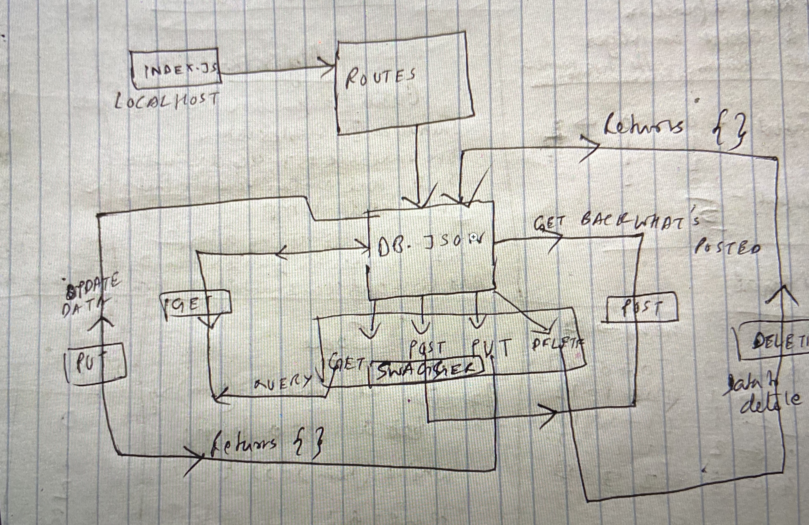

# LAB - 06

## HTTP and REST

### Author: Shubham Majumdar

### Links and Resources
* [submission PR](https://github.com/Shubham-401n16/Lab06/pull/1)
* [Github Actions](https://github.com/Shubham-401n16/Lab06/actions)

#### Documentation
* [api docs](https://app.swaggerhub.com/apis/smajumdar22/RestAndHttp/0.1) 
* JSDoc Comment Required for all modules and functions in all .js files

### Setup
#### `.env` requirements (where applicable)
*npm i -g json-server

#### How to initialize/run your server app (where applicable)
* node index.js
  
#### Tests
* How do you run tests?
npm test

#### UML

